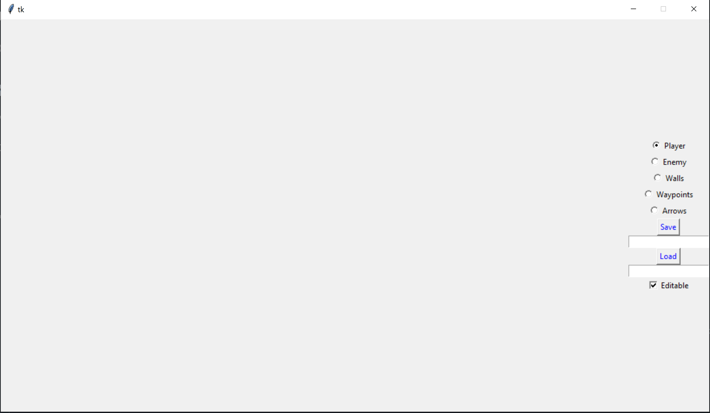
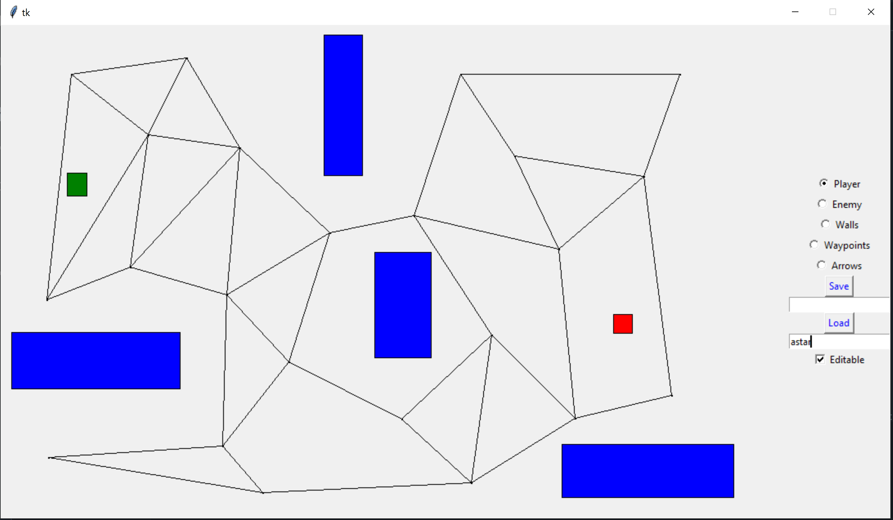
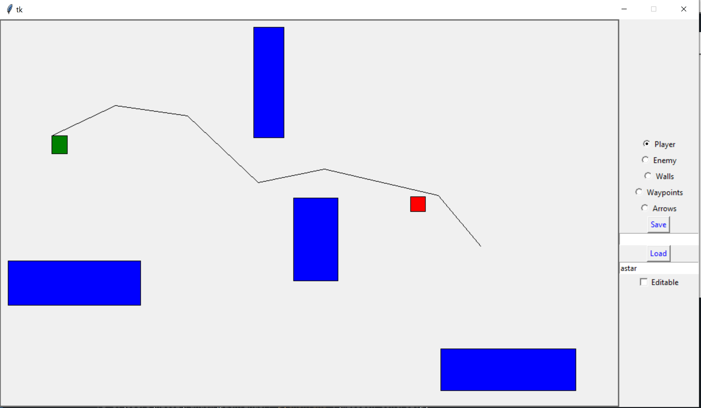
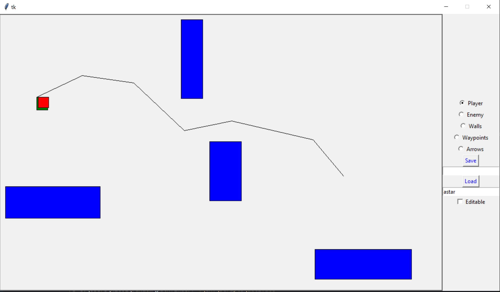

# Pathfinding

## What?
A 2D Level building in Python.

## Requirements
requirements.txt (you should know this by now)

## Features

### Objects:

* Walls (Green Rectangle)
* Player (Blue Rectangle)
* Enemy (Red Rectangle)
* Waypoints (Black Pixels w/ radius ~1 pixel)
* Lines (Black Lines, Called Arrows, Used for pathing)

### Save System:

Once are done drawing you can save the level by providing a name under the *Save* button and clicking save.
It will save the level by whatever you called it. You can then load the level later using the same name under the *Load*
button and pressing the *Load* button. YOU CAN EDIT AFTER LOADING JUST **CHECK EDITABLE** (THINK OF IT AS PUTTING IT INTO EDIT STATE).

### Movement:
IF YOU HAVE  **UNCHECKED EDITABLE** (THINK OF IT AS PUTTING IT IN THE PLAY STATE), you can move the player if you made him (Green Rectangle).
Press UP, DOWN, LEFT, and RIGHT. Cannot go through walls.

## How to Use
1. `python mission_control.py`
2. Select the object you want to draw from the sidebar on the right
3. Draw some objects on space to left (At least player, enemy, and some waypoints with lines to get pathing to work)! Some Notes:
* Nothing can be drawn on walls (it will not allow you)
* Lines connect waypoints (it is used for pathing)
* If a line is intersected by a wall it will not be drawn (vice versa too!)
* **THE EDITABLE BOX MUST BE CHECKED TO EDIT**
4. When you are done editing, **UNCHECK EDITABLE** and press **TAB** until it is focused on drawable space (canvas will be outlined)
5. Press **ENTER** (or don't, you could always just move player around if that's your cup of tea)
6. Press the **X** in the top right corner to close!

## Tell Me a Story
At one point in my life I wanted to make an AI that could follow around a player. In this case the AI and player would just
be rectangles. I decided I would add the ability to draw walls to make the level more complex. Initally I wanted this to work without
waypoints. Essentially the enemy would continually reconsider the path to the player using every pixel available in order to not use waypoints.

With childlike innocence I began to work on this. After getting the GUI set up I implemented the Astar algorithm for pathfinding with it considering
every single pixel on the canvas. I quickly saw why this was not feasable. After being scarred by 10 minute wait times for the path to be found,
I realized the merit to using waypoints if I was already aware of the obstacles (walls in this case) in a level. I now understand why video games
(I'm looking at you *TES5: Skyrim*, have AI pathing that at the time I though was coded by a literal monkey). 

So here we are now. I re-did things to work with waypoints and lines for pathing. The pathing is significantly faster. Obviously if the waypoints
are set up poorly then the pathing could be really bad. Currently it only paths to the place the player was at when the algorithm starts, it is not
receptive to changes in the players movement. I don't really work on this any more but maybe I will come back to this one day.

## Some Bugs (Features)
* The pathing is currently in an *in progress* state.
  * I miscoded the slope and so it moves in a funny way (off path)
* Sometimes prints "DONE" 2 times after it is done moving, not sure why :/
* Some might say the file structure itself is a giant bug but I like it

## Upcoming work (I don't know when but sometime maybe)
* Fix the movement
* Consistent speed when moving
* Recheck path every 2-3 seconds to make sure it continues moving towards player
* Check for valid path by making sure the enemy will not hit walls in path
* Add in some point system like in PACMAN with *coins* or something on ground
* Make the enemy an actual AI by adding different *states*
  * Hunting state when AI *sees* player and starts pathing to them
  * Eating state, if AI gives up looking for player or doesn't see them it starts collecting coins/food

## Pics or it didn't happen
This is what it looks like after booting up

Here I have loaded in a level that was saved under the name *astar*, as you can see
I can't see the waypoints or lines. They are only visible if I check **EDITABLE**.

Here I checked Editable (WOW!). This shows all the waypoints and paths between waypoints
I had specified.

**AFTER UNCHECKING EDITABLE** I then clicked **TAB** an ungodly amount of times until it was focused on canvas.
After clicking **ENTER**, a path was found from enemy to player in world record time. The enemy starts moving. At
this point if you ran it you would notice the speed is not consistent, again I am working on it (someday).

Just to humble myself here is an example of it moving completely off path due to terrible slope logic. It does eventually
get back on the path!

It's back on the path baby!

Eventually the enemy catches up to the player. Doesn't do anything.
